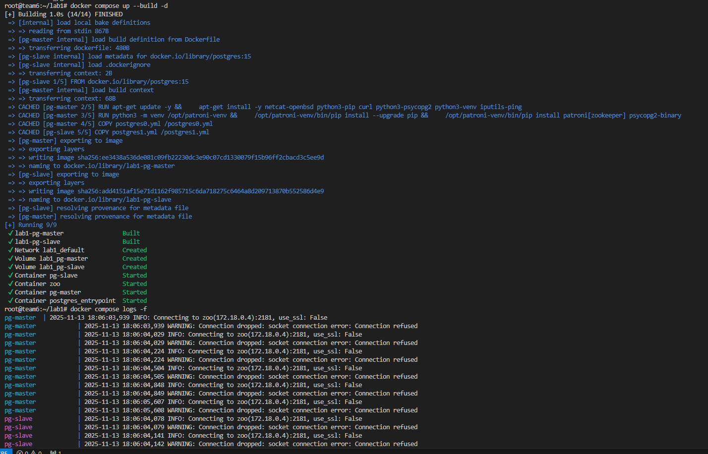
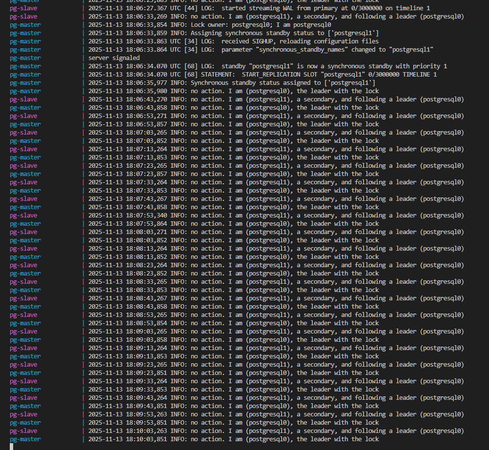
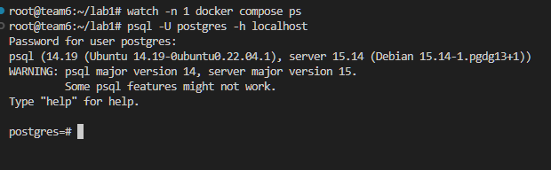
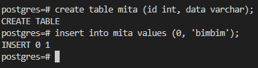
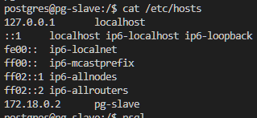
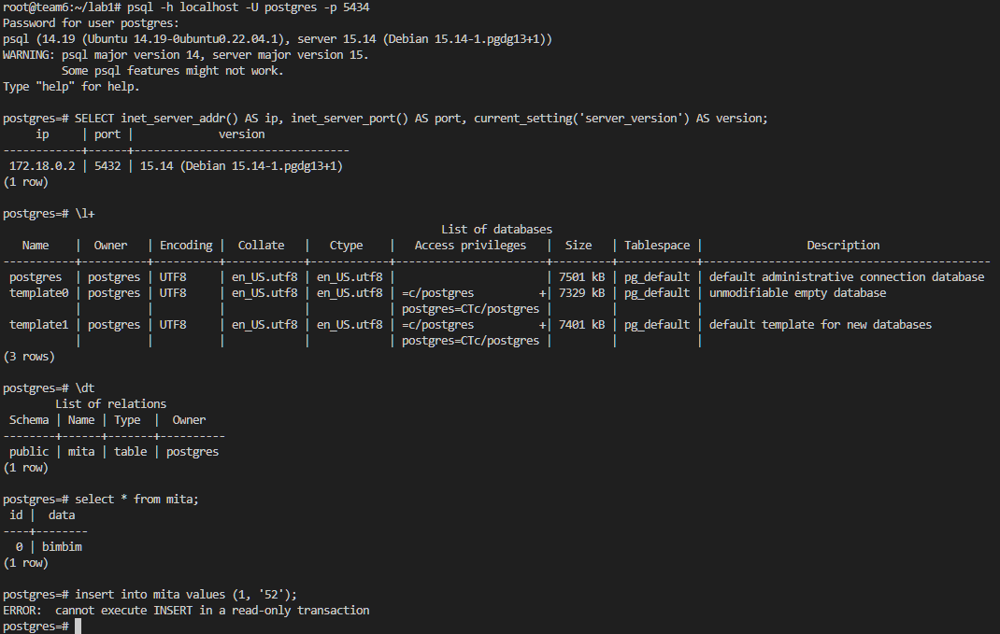
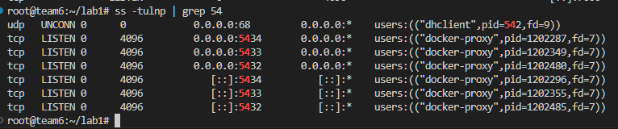
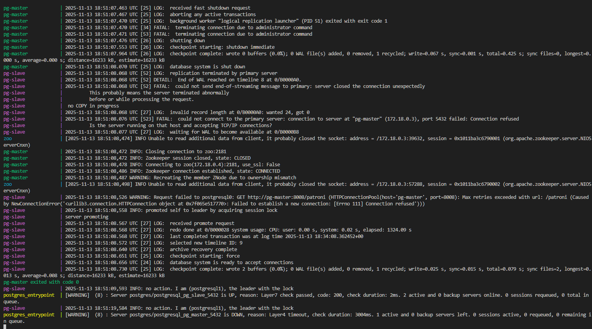
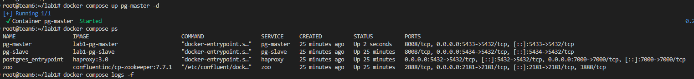
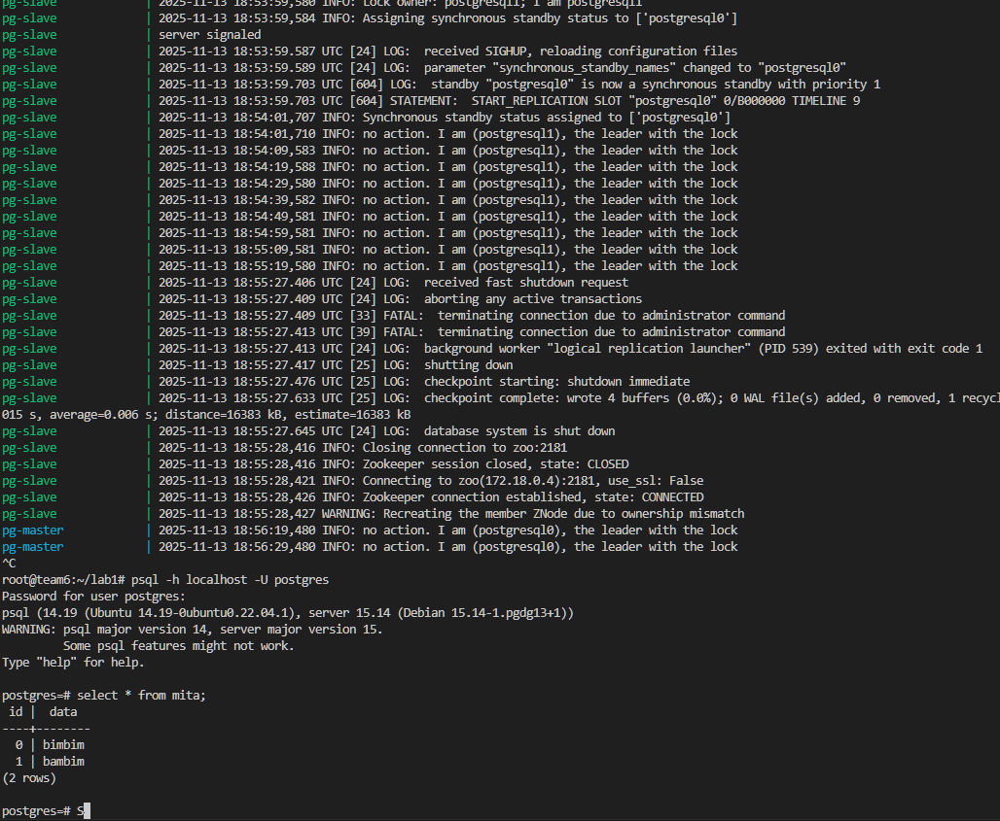

# ЛР 3 (1). HA Postgres Cluster

## Поднимаем postgres

#### Dockerfile:

```dockerfile
FROM postgres:15

RUN apt-get update -y && \
    apt-get install -y netcat-openbsd python3-pip curl python3-psycopg2 python3-venv iputils-ping

RUN python3 -m venv /opt/patroni-venv && \
    /opt/patroni-venv/bin/pip install --upgrade pip && \
    /opt/patroni-venv/bin/pip install patroni[zookeeper] psycopg2-binary

COPY postgres0.yml /postgres0.yml
COPY postgres1.yml /postgres1.yml

ENV PATH="/opt/patroni-venv/bin:$PATH"

USER postgres
```

## И композ с посгрей мастер, слейв, зукипер и хапрокси

#### docker-compose.yml:
```yml
services:
  pg-master:
    build: .
    container_name: pg-master
    restart: always
    hostname: pg-master
    environment:
      POSTGRES_USER: postgres
      POSTGRES_PASSWORD: s
      PGDATA: '/var/lib/postgresql/data/pgdata'
    expose:
      - 8008
    ports:
      - 5433:5432
    volumes:
      - pg-master:/var/lib/postgresql/data
    command: patroni /postgres0.yml

  pg-slave:
    build: .
    container_name: pg-slave
    restart: always
    hostname: pg-slave
    expose:
      - 8008
    ports:
      - 5434:5432
    volumes:
      - pg-slave:/var/lib/postgresql/data
    environment:
      POSTGRES_USER: postgres
      POSTGRES_PASSWORD: s
      PGDATA: '/var/lib/postgresql/data/pgdata'
    command: patroni /postgres1.yml

  zoo:
    image: confluentinc/cp-zookeeper:7.7.1
    container_name: zoo
    restart: always
    hostname: zoo
    ports:
      - 2181:2181
    environment:
      ZOOKEEPER_CLIENT_PORT: 2181
      ZOOKEEPER_TICK_TIME: 2000

  haproxy:
    image: haproxy:3.0
    container_name: postgres_entrypoint
    ports:
      - 5432:5432
      - 7000:7000
    depends_on:
      - pg-master
      - pg-slave
      - zoo
    volumes:
      - ./haproxy.cfg:/usr/local/etc/haproxy/haproxy.cfg

volumes:
  pg-master:
  pg-slave:
```


## Конфиг посгри

#### postgres[0-1].yml:
```yml
scope: psql_cluster
name: postgresql0

restapi:
  listen: pg-master:8008
  connect_address: pg-master:8008

zookeeper:
  hosts:
    - zoo:2181

bootstrap:
  dcs:
    ttl: 30
    loop_wait: 10
    retry_timeout: 10
    maximum_lag_on_failover: 10485760
    master_start_timeout: 300
    synchronous_mode: true
    postgresql:
      use_pg_rewind: true
      use_slots: true
      parameters:
        wal_level: replica
        hot_standby: "on"
        wal_keep_segments: 8
        max_wal_senders: 10
        max_replication_slots: 10
        wal_log_hints: "on"
        archive_mode: "always"
        archive_timeout: 1800s
        archive_command: mkdir -p /tmp/wal_archive && test ! -f /tmp/wal_archive/%f && cp %p /tmp/wal_archive/%f

  pg_hba:
    - host replication replicator 0.0.0.0/0 md5
    - host all all 0.0.0.0/0 md5

postgresql:
  listen: 0.0.0.0:5432
  connect_address: pg-master:5432
  data_dir: /var/lib/postgresql/data/postgresql0
  bin_dir: /usr/lib/postgresql/15/bin
  pgpass: /tmp/pgpass0
  authentication:
    replication:
      username: replicator
      password: w
    superuser:
      username: postgres
      password: s
  parameters:
    unix_socket_directories: '.'

watchdog:
  mode: off

tags:
  nofailover: false
  noloadbalance: false
  clonefrom: false
  nosync: false
```

> Порты 8008 и 5432 вынесены в разные директивы, expose и ports. По сути, если записать 8008 в ports, то он тоже станет exposed. В чем разница?

- Разница в том, что expose открывает порт только внутри сети докера, а ports дополнительно пробрасывает их на сеть хоста


## Поднимаем

```sh
docker compose up --build -d
docker compose logs -f
```


#### Смотрим логи:
```
pg-master - leader node
pg-slave - secondary node
```




> При обычном перезапуске композ-проекта, будет ли сбилден заново образ?

- Нет

> А если предварительно отредактировать файлы postgresX.yml?

- Нет

> А если содержимое самого Dockerfile?

- Нет

> Почему?

- докер-композ не пересобирает образы автоматически чтобы избежать лишних затрат, при любом изменении лучше прописывать `--build`


## Проверим репликацию

```sh
psql -h localhost -U postgres
```



### запишем данные в pg-master



### зайдем в бд pg-slave

#### (проверим по ip, что это точно pg-slave)



### видим нашу таблицу




# HA

И тут я вспомнил, что haproxy надо было добавить только сейчас)

В любом случае видим, что каждая бд поднята на своём порту и всё ок



### Роняем мастер ноду

```sh
docker compose stop pg-master
```



### Запишем данные в pg-slave


### Поднимем pg-master и уроним pg-slave, чтобы мастер снова стал лидером



### Проверим что данные перенеслись



### Это произошло потому что в конфигах postgres мы уже прописали механизм репликации WAL (Write-Ahead Log) и архивацию WAL-сегментов

```yml:
bootstrap:
  dcs:
    postgresql:
      parameters:
        wal_level: replica
        hot_standby: "on"
        wal_keep_segments: 8
        max_wal_senders: 10
        max_replication_slots: 10
        wal_log_hints: "on"
        archive_mode: "always"
        archive_timeout: 1800s
        archive_command: mkdir -p /tmp/wal_archive && test ! -f /tmp/wal_archive/%f && cp %p /tmp/wal_archive/%f

  pg_hba:
    - host replication replicator 0.0.0.0/0 md5
```

#
###### that's it
