# ЛР 1 (2). Loki + Zabbix + Grafana

## Поднимаем Nextcloud, Loki, Promtail, Grafana, Zabbix и Postgres

#### docker-compose.yml:
```yml
services:
  nextcloud:
    image: nextcloud:29.0.6
    container_name: nextcloud
    ports:
      - "8080:80"
    volumes:
      - nc-data:/var/www/html/data

  loki:
    image: grafana/loki:2.9.0
    container_name: loki
    ports:
      - "3100:3100"
    command: -config.file=/etc/loki/local-config.yaml

  promtail:
    image: grafana/promtail:2.9.0
    container_name: promtail
    volumes:
      - nc-data:/opt/nc_data
      - ./promtail_config.yml:/etc/promtail/config.yml
    command: -config.file=/etc/promtail/config.yml

  grafana:
    image: grafana/grafana:11.2.0
    container_name: grafana
    environment:
      GF_PATHS_PROVISIONING: /etc/grafana/provisioning
      GF_AUTH_ANONYMOUS_ENABLED: true
      GF_AUTH_ANONYMOUS_ORG_ROLE: Admin
    ports:
      - "3000:3000"
    volumes:
      - grafana-data:/var/lib/grafana
    command: /run.sh

  postgres-zabbix:
    image: postgres:15
    container_name: postgres-zabbix
    environment:
      POSTGRES_USER: zabbix
      POSTGRES_PASSWORD: zabbix
      POSTGRES_DB: zabbix
    volumes:
      - zabbix-db:/var/lib/postgresql/data
    healthcheck:
      test: ["CMD", "pg_isready", "-U", "zabbix"]
      interval: 10s
      retries: 5
      start_period: 5s

  zabbix-server:
    image: zabbix/zabbix-server-pgsql:ubuntu-6.4-latest
    container_name: zabbix-back
    environment:
      POSTGRES_USER: zabbix
      POSTGRES_PASSWORD: zabbix
      POSTGRES_DB: zabbix
      DB_SERVER_HOST: postgres-zabbix
    ports:
      - "10051:10051"
    depends_on:
      - postgres-zabbix

  zabbix-web-nginx-pgsql:
    image: zabbix/zabbix-web-nginx-pgsql:ubuntu-6.4-latest
    container_name: zabbix-front
    environment:
      POSTGRES_USER: zabbix
      POSTGRES_PASSWORD: zabbix
      POSTGRES_DB: zabbix
      DB_SERVER_HOST: postgres-zabbix
      ZBX_SERVER_HOST: zabbix-back
    ports:
      - "8082:8080"
    depends_on:
      - postgres-zabbix

volumes:
  nc-data:
  grafana-data:
  zabbix-db:
```

#### promtail_config.yml:

```yml
server:
  http_listen_port: 9080
  grpc_listen_port: 0

positions:
  filename: /tmp/positions.yaml

clients:
  - url: http://loki:3100/loki/api/v1/push

scrape_configs:
- job_name: system
  static_configs:
  - targets:
    - localhost
    labels:
      job: nextcloud_logs
      __path__: /opt/nc_data/*.log
```

### Стартуем

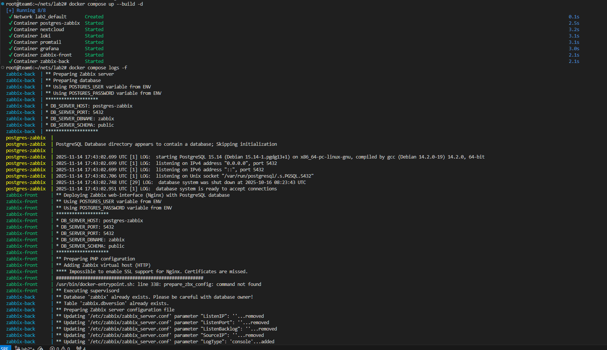

```sh
docker compose ps
```

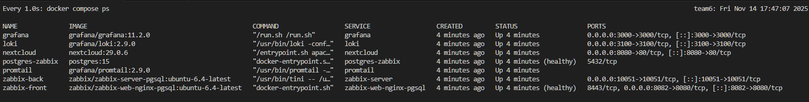

### Заходим на веб некстклауда и создаем аккаунт админа, ждем достаточно долгое поднятие бд и аккаунта

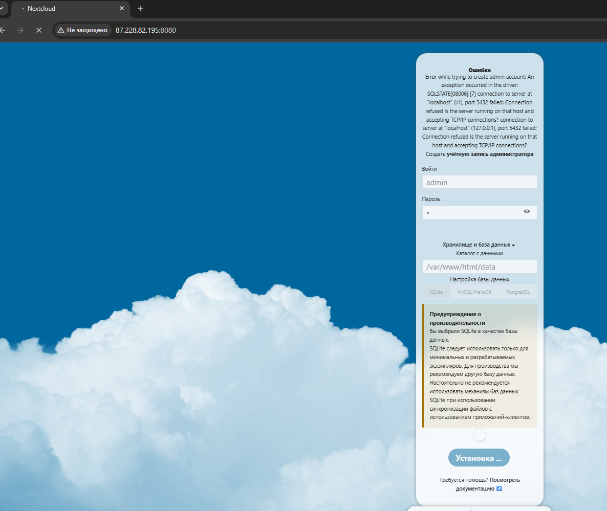

### Смотрим логи

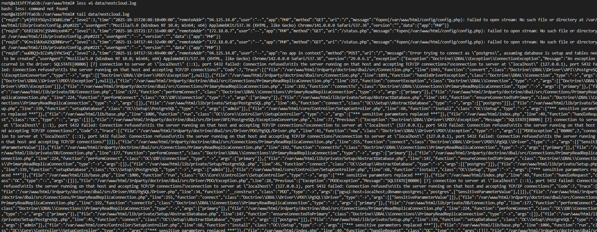

### И логи промтейла

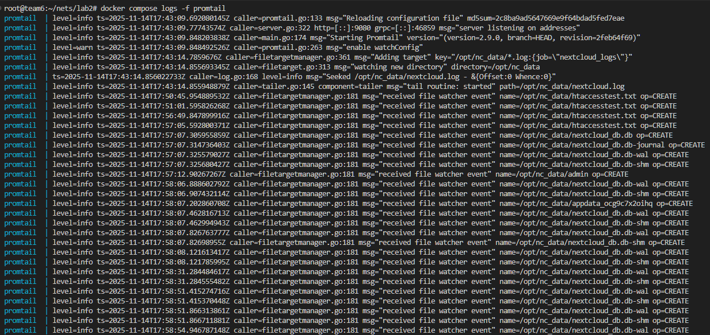

### Видим в них, что он подцепил логи некстклауда

### Добавим темплейт для заббикса

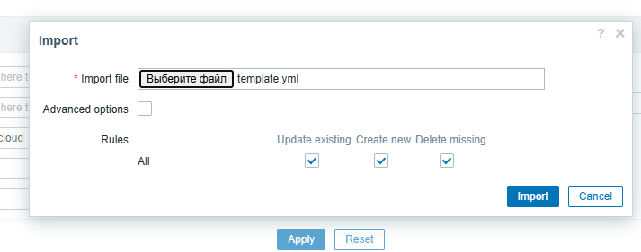

### Разрешим некстклауду резолвить имя nextcloud

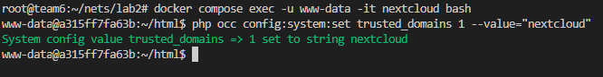

### Добавим хост

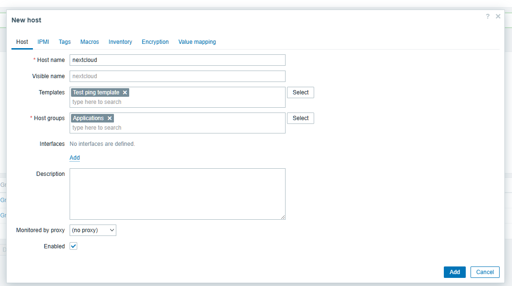

### Поставили некстклауд на мониторинг

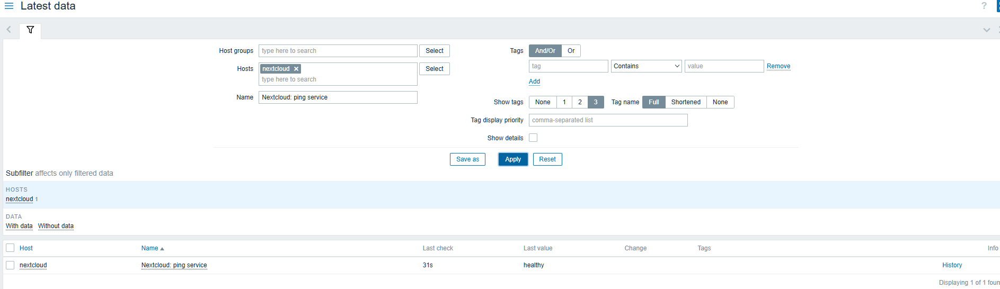


# Визуализация

### Установим плагин для заббикса и включим его

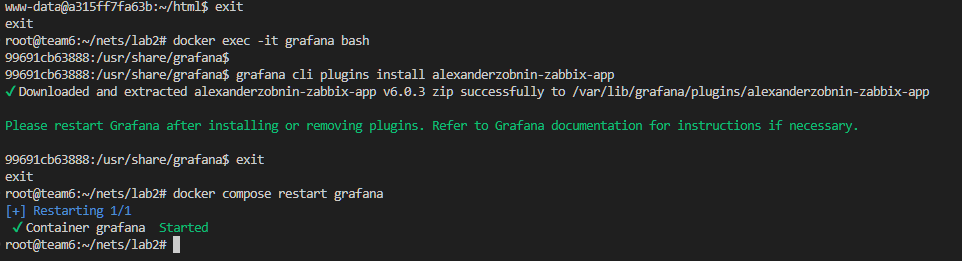

### Подключим локи и заббикс

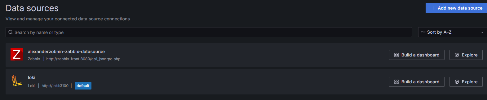


### И сделаем простой дашборд

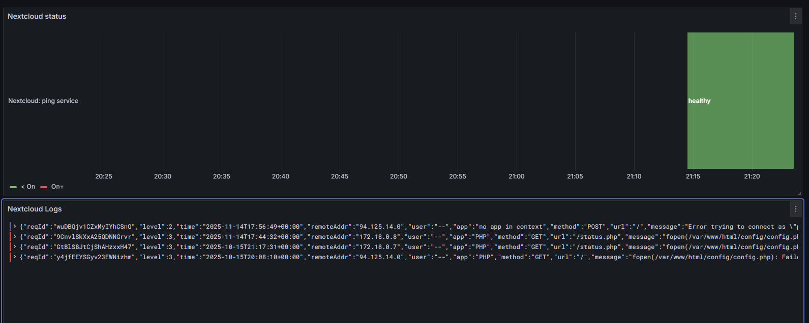

# Вопросы

> Чем SLO отличается от SLA?

- SLO - это показатель, который мы пытаемся достичь для конкретной метрики нашего сервиса. Например, аптайм в 99.99999%
- SLA - это соглашение с заказчиком, оно обычно включает в себя выполнение SLO, также оно может описывать штрафы за несоблюдение этого соглашения

> Чем отличается инкрементальный бэкап от дифференциального?

- инкрементальный бэкап сохраняет изменения с момента последнего **любого** бэкапа, а дифференциальный с момента **полного** бэкапа

> В чем разница между мониторингом и observability?

- мониторинг - это сбор и визуализация метрик и логов, а observability - это *прокаченное* наблюдение за сервисом, анализ метрик, получение более детальных логов, трассировки запросов, поиск корреляций и закономерностей в логах и метриках

#
###### that's it
