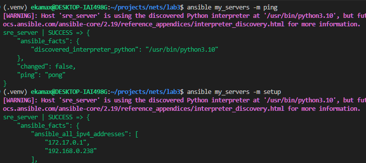
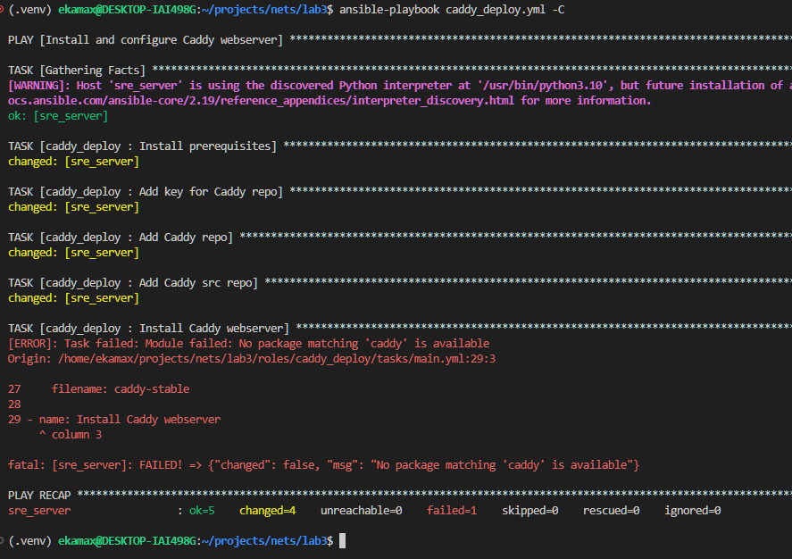
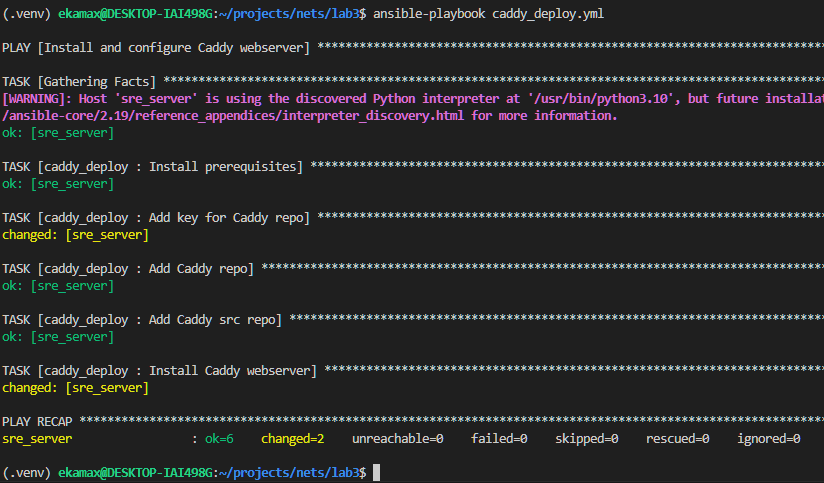
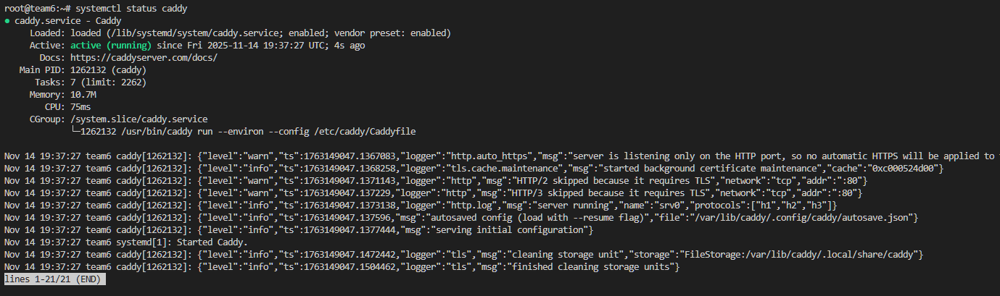
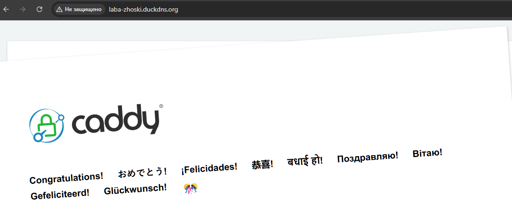
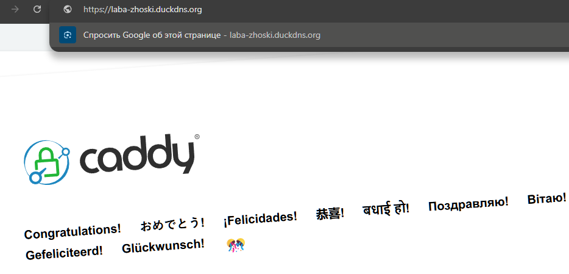
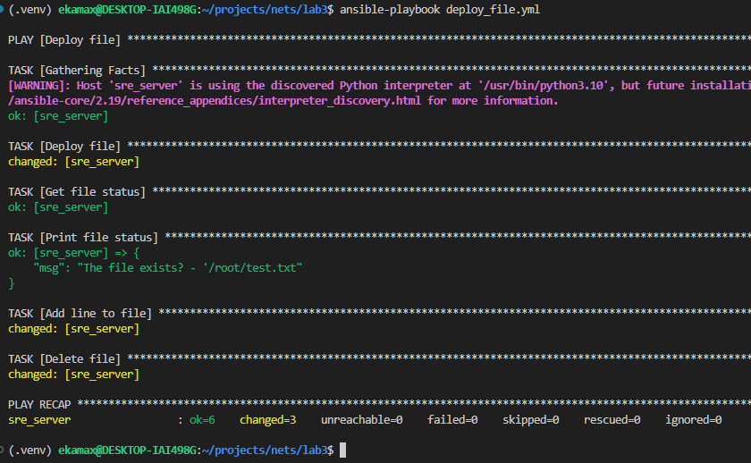
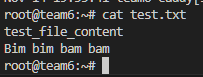

# ЛР 2 (3). Ansible + Caddy

### Всё скачаем, настроим и пинганем сервер



### Добавим файл на сервер и удалим


#### Видим CHANGED, значит всё сработало и файл удалился

### Создадим роль для раскатки Caddy

```roles/caddy_deploy/tasks/main.yml:```

```yml
---

- name: Install prerequisites
  ansible.builtin.apt:
    pkg:
      - debian-keyring
      - debian-archive-keyring
      - apt-transport-https
      - curl

- name: Add key for Caddy repo
  ansible.builtin.apt_key:
    url: https://dl.cloudsmith.io/public/caddy/stable/gpg.key
    state: present
    keyring: /usr/share/keyrings/caddy-stable-archive-keyring.gpg

- name: Add Caddy repo
  ansible.builtin.apt_repository:
    repo: "deb [signed-by=/usr/share/keyrings/caddy-stable-archive-keyring.gpg] https://dl.cloudsmith.io/public/caddy/stable/deb/debian any-version main"
    state: present
    filename: caddy-stable

- name: Add Caddy src repo
  ansible.builtin.apt_repository:
    repo: "deb-src [signed-by=/usr/share/keyrings/caddy-stable-archive-keyring.gpg] https://dl.cloudsmith.io/public/caddy/stable/deb/debian any-version main"
    state: present
    filename: caddy-stable

- name: Install Caddy webserver
  ansible.builtin.apt:
    name: caddy
    update_cache: true
    state: present
```

### И сам плейбук:
```yml
---

- name: Install and configure Caddy webserver
  hosts: my_servers

  roles:
    - caddy_deploy
```

### Прогоним плейбук сначала в dry-run



## С точносью до наличия деб пакета на хосте всё ок)

### Теперь прогоним по-настоящему



### Всё поднялось всё ок



### Берём крутой домен, заходим и видим что всё работает



### Добавим шаблон и переменные

Caddyfile.j2:
```jinja
{{ domain_name }} {
    root * /usr/share/caddy
    file_server

    log {
        output file {{ log.file }}
        format json
        level {{ log.level }}
    }
}
```

vars/main.yaml:
```yml
---

domain_name: laba-zhoski.duckdns.org

log:
  file: /var/log/caddy/access.log
  level: "INFO"
```

### Перекатим плейбук, и всё работает



## Создание и удаление файла

deploy_file.yml:
```yml
---

- name: Deploy file
  hosts: all

  tasks:
    - name: Deploy file
      ansible.builtin.copy:
        dest: $HOME/test.txt
        content: test_file_content
        mode: "644"

    - name: Get file status
      ansible.builtin.stat:
        path: $HOME/test.txt
      register: file_check_result

    - name: Print file status
      ansible.builtin.debug:
        msg: "The file exists? - '{{ file_check_result.stat.path }}"

    - name: Add line to file
      ansible.builtin.lineinfile:
        path: $HOME/test.txt
        line: "Bim bim bam bam"
        state: present

    - name: Delete file
      ansible.builtin.file:
        dest: $HOME/test.txt
        state: absent
```

### Запустим



file:


## Все работы выполнены на выданном сервере, спасибо

#
###### that's it
